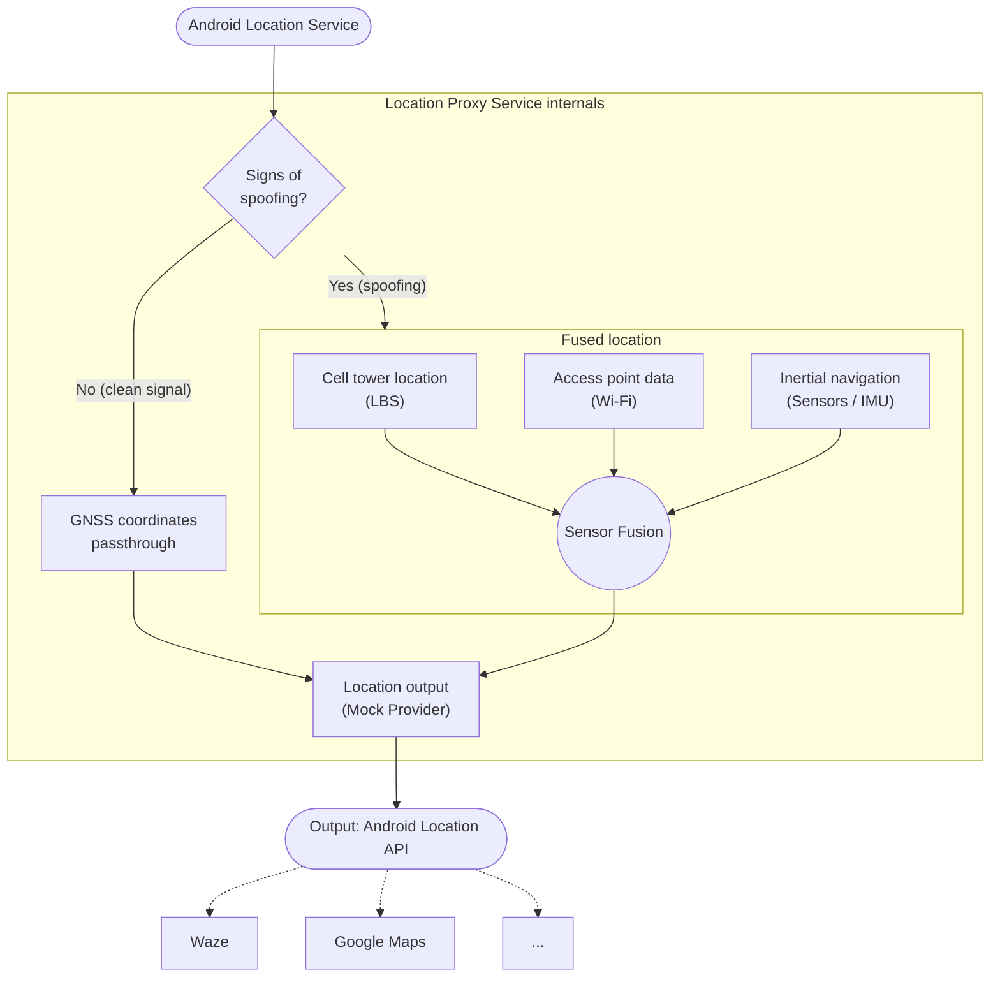

# mobile-lps

Location proxy service for Android.

## Purpose

Keep navigation stable in areas affected by GNSS spoofing. Instead of building yet another navigation app, mobile-lps fixes the location source itself: it provides an accurate position through the standard Android location API, so any existing navigator (Waze, Google Maps, etc.) works without changes.

## How it works

1. The service reads raw GNSS data from the Android location service.
2. A detector checks the signal for signs of spoofing.
3. If the signal is clean, GNSS coordinates are passed through as is.
4. If spoofing is detected, the position is computed from other sources — cell towers (LBS), Wi-Fi access points and inertial navigation (IMU) — fused with sensor fusion algorithm (WIP).
5. The resulting location is published via a mock location provider and consumed by navigation apps through the regular Android location API.

## Architecture

Approximate architecture:



## Tech stack

- **Language:** Kotlin, native Android.
- **UI:** Jetpack Compose.
- **Build:** Gradle (Kotlin DSL) with a version catalog (`gradle/libs.versions.toml`) and convention plugins (`build-logic/`).
- **Quality:** ktlint (via Spotless), Prettier (Markdown, YAML, JSON), taplo (TOML), detekt, Android Lint (warnings are errors), pre-commit hooks, GitHub Actions CI.

## Development

### Requirements

- [mise](https://mise.jdx.dev/) — installs the pinned JDK and pre-commit from `.mise.toml`.
- Android SDK. Point to it with `ANDROID_HOME` or `sdk.dir` in `local.properties` (Android Studio creates it automatically). Missing SDK platforms are downloaded by Gradle.

Gradle is pinned by the wrapper (`./gradlew`), so it does not need to be installed.

### Setup

```sh
mise run setup    # installs JDK + pre-commit, registers git hooks (formatting on commit, detekt on push)
```

Enable `mise activate` in your shell so the pinned JDK is picked up automatically inside the project.

### Common tasks

```sh
./gradlew assembleDebug        # build debug APK
./gradlew installDebug         # install on a connected device
./gradlew spotlessApply        # format Kotlin sources
./gradlew spotlessCheck detekt lint testDebugUnitTest   # everything CI checks
```
